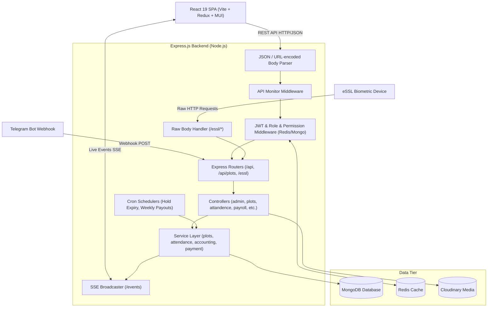

# ARCHITECTURE.md — Architecture & Important Data Flows

## 1. High-Level Architecture



---

## 2. Request Lifecycle & Middleware Pipeline

1. **CORS Configuration**:
   - Explicitly configured for `http://localhost:5173` with credentials support.
2. **Raw Body Handling**:
   - Routes starting with `/essl/iclock/*` consume incoming device packets as raw strings on `req.bodyRaw`.
3. **API Performance Monitor**:
   - `apiMonitorMiddleware` captures monotonic high-resolution start time (`process.hrtime.bigint()`).
   - On `res.on('finish')`, records latency into a circular in-memory buffer (capped per route pattern).
4. **Authentication & Access Control**:
   - `auth_middleware.js`: Extracts `Authorization: Bearer <token>`, verifies JWT against `process.env.JWT_Key`, attaches `req.user` and `req.userid`.
   - `Role_middleware.js`: Restricts routes by array of allowed roles.
   - `checkpermission.js`: Checks granular permission matrix `(module, actionInt)`. Evaluates `permissions:<userId>` in Redis first; on miss, queries MongoDB and sets a 15-day TTL cache.
5. **Standard API Response Formatter**:
   - `ApiResponse.success(res, data, message, statusCode)`
   - `ApiResponse.created(res, data, message)`
   - `ApiResponse.paginated(res, items, pagination, message)`
6. **Global Error Handling**:
   - `utils/error_util.js` captures unhandled exceptions and standardizes 500/400 error payloads.

---

## 3. Key Data Flows

### A. Attendance Ingestion & Normalization
```
[eSSL Device / Web Punch] 
       │ (Punch Timestamp / Local Time)
       ▼
[parseAttendanceDateTime & getAttendanceDateUTC]
       │ Normalized Date: YYYY-MM-DDT00:00:00.000Z (UTC Midnight)
       │ Shift Calculation Timezone: Asia/Kolkata (IST)
       ▼
[Attendance Record Upsert / Punch-In / Punch-Out]
       │ Computes: duration, late arrival, overtime, half-day status
       ▼
[Weekly Off & Leave Synchronization] ──> [SSE Live Broadcast to Admins] ──> [Telegram Alert]
```

### B. Plot Booking, Collection, & Weekly Payout Flow
```
1. Plot Series Created ──> Automated Individual Plot Inventory Generation
2. Customer / Sponsor Assigned ──> Booking Created (Status: 'HOLD' or 'ACTIVE')
3. Scheduled Hold Expiry ──> plotHoldScheduler runs hourly to expire abandoned holds
4. Installment Collection ──> PlotPayment + PlotReceipt Created ──> Ledger Balance Updated
5. Weekly Payout / Return ──> plotPayoutScheduler computes due payouts ──> PlotPayoutSchedule / Voucher Created
```

### C. Real-Time Events (SSE)
- Endpoint: `GET /events?token=<jwt>`
- Server maintains connected clients with metadata (`companyId`, `branchId`, `role`).
- `sendToClients(data, companyId, branchId)` delivers selective event payloads (e.g. punch-in, checkout, system notifications) only to relevant branch managers and company admins.
